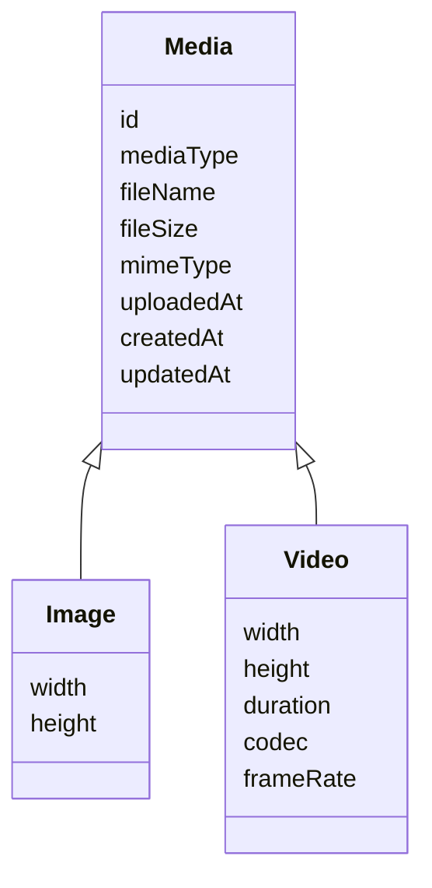

# Mediaドメイン

> 状態: 将来（合意済み・未実装）  
> 最終確認日: 2026-08-15

## 目的

Memoriaは静止画像と動画を管理・共有・継承するシステムです。汎用ストレージサービスではなく、Word、PDF、記事、音声単体などは対象に含めません。

初期設計で使用していた`Content`は、今後の設計では`Media`へ読み替えます。現行実装の`Image`、DB、GraphQLはまだ変更せず、実装時に段階的な移行を設計します。

## 概念

| 概念 | 意味 | 状態 |
| --- | --- | --- |
| Media | Memoriaが管理する静止画像または動画 | 設計確定・未実装 |
| Image | 静止画像固有の情報と処理 | 現行実装あり |
| Video | 動画固有の情報と処理 | 将来 |
| Media Group | Mediaを分類するDAG | Image Groupとして一部実装 |
| Media Event | Mediaに対する重要操作のトレース | 将来 |

## 用語と境界

- **Uploader**: Mediaを最初にアップロードしたUser
- **Custodian**: Mediaを現在管理する1 Userまたは1 Community
- **Viewer**: 公開先Communityへの参加を通してMediaを閲覧するUser
- **Media Event**: アップロード、委譲、公開変更、削除などの重要操作

UploaderとCustodianは異なる概念です。アップロードした人を著作権者または法的所有者とは扱いません。著作権者、利用許諾、権利移転はシステムで管理しません。

## 基本制約

1. Mediaには常に1つのCustodianが存在する
2. Custodianは1 Userまたは1 Communityのどちらか一方
3. 管理責任と閲覧可能範囲を分離する
4. User管理Mediaは複数Communityへ公開できる
5. Community管理Mediaは別Communityへ公開しない
6. Community内部では参加者全員が公開Mediaを閲覧できる
7. Media Groupは分類専用で、管理・閲覧権限に影響しない
8. 削除したMediaは復元できない

## 設計と現行実装

このページは将来のドメイン設計の正本です。現在利用可能な契約とデータ構造は、引き続き以下を正本とします。

- `memoria-api/schemas/graphql/*.graphql`
- `memoria-api/schemas/postgres/schema.sql`
- `memoria-api`のresolver、service、repository

## 関連資料

- [管理主体と委譲](./management)
- [Communityと公開範囲](./community-access)
- [Media Group](./group)
- [ライフサイクル](./lifecycle)
- [User削除](./user-deletion)
- [実装・設計整合状況](../implementation-status)
