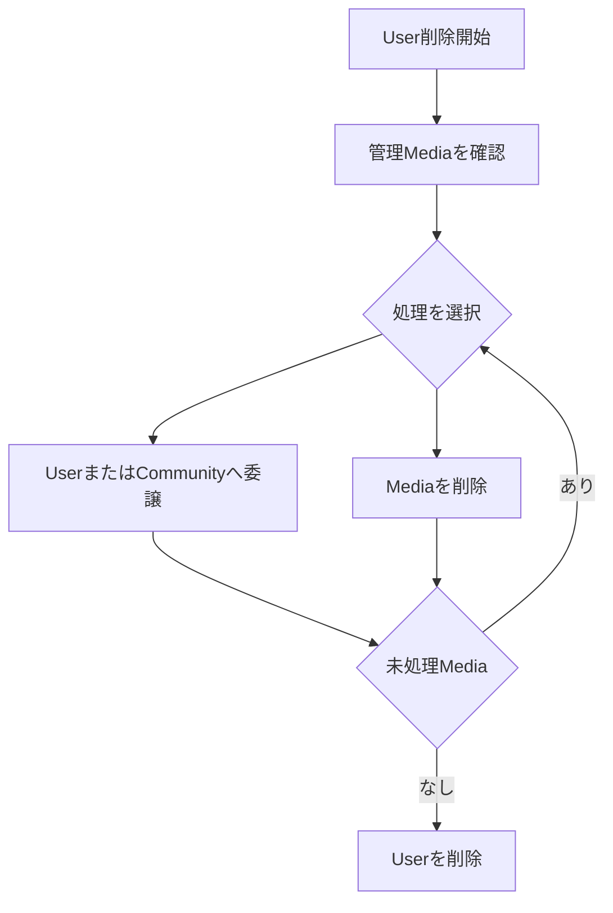

# User削除時のMedia処理

## 概要

> 実装状況: User削除時にMediaを委譲または削除させる処理は未実装です。

## 原則

Mediaを世代をまたいで引き継ぐことを重視しますが、すべてのMediaを必ず保存することは強制しません。User削除時は、Userが管理するMediaごとに委譲または削除を選択します。

未処理の管理Mediaが残っている状態ではUserを削除できません。Custodianが存在しないMediaは作りません。

## 操作単位

- Media単位で委譲または削除を選べる
- 複数Mediaを一括選択できる
- 全Mediaを一括委譲または一括削除できる
- Media Groupを選択条件として利用できる

Media Groupは分類であり管理単位ではありません。「Groupを委譲」するのではなく、Group内のMediaを一括選択して処理します。

## 委譲

- UserまたはCommunityを委譲先にできる
- 委譲時に既存公開をすべて解除する
- Uploader情報は変更しない
- 委譲をMedia Eventへ記録する

## 削除

- Mediaを物理削除する
- 復元できないことを明示する
- Group関連と公開設定も削除する
- 削除をMedia Eventへ記録できる

## User削除との関係

Uploaderとしての参照は、User削除後に不明となることを許容します。Media Eventのactorも同様です。Userの個人情報をMedia保存のためだけに永久保持しません。

Communityの唯一の管理者、Membership、招待などはMediaとは別のUser削除条件です。Communityのライフサイクル設計で扱います。
