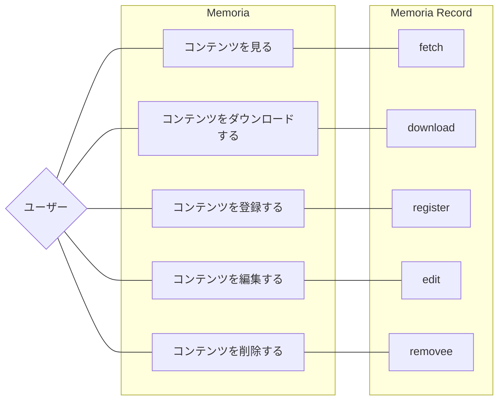
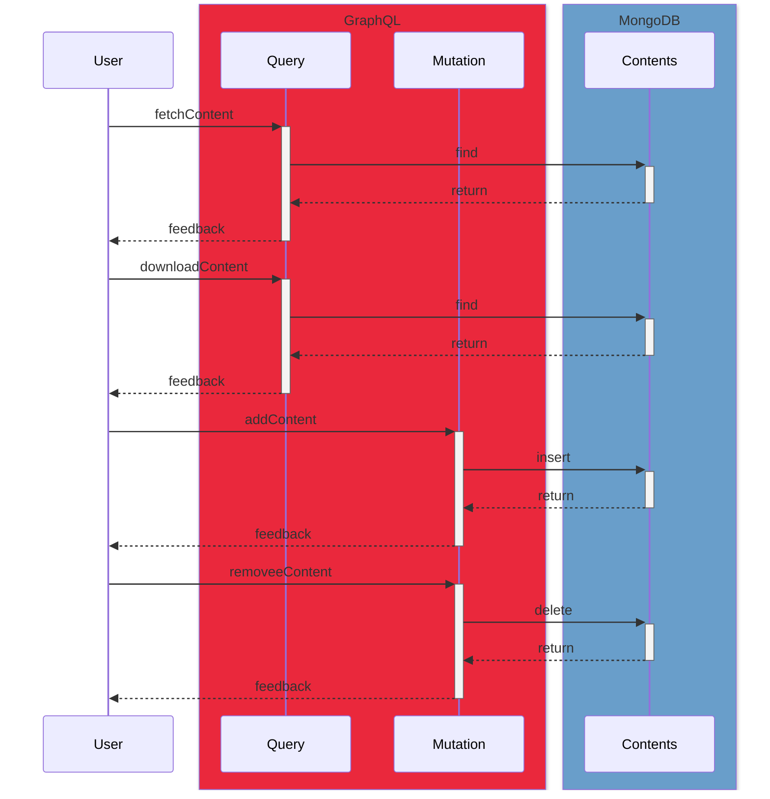

# 概要

マイクロサービス「Memoria Record」に関する情報を記載しています。

## サービスの責務

TODO: 記載する。合わせて記載方法も検討する。

## ユースケース



## シーケンス



TODO: 削除対象が存在しないときの挙動を検討する

## データモデル

### GraphQL

```graphql
scalar Upload

type Content {
  id: ID!
  workspaceId: String!
  tags: [String!]!
  name: String!
  extension: String!
  type: String
  size: Int!
  paths: FilePathInfo!
  image: ImageInfo
  createdAt: String!
  updatedAt: String!
}

type FilePathInfo {
  original: String!
  thumbnail: String!
}

type ImageInfo {
  width: Int
  height: Int
  dateTime: String
}

type Mutation {
  registerContent(file: Upload!, workspaceId: String!, tags: [String!]!): Content!
  removeContent(id: ID!): Content!
}

type Query {
  fetchContent(id: ID!): Content
  downloadContent(id: ID!): Content
}
```

NOTE: 
コードブロックにgraphqlを指定してそのまま定義を設計する。今のところ*.graphqlsファイルからコードを生成し、ロジックだけを実装する想定。上記のスキーマ定義はgraphqlで扱うデータモデルやフィールドのrequire,optionalが含まれている。しかし入力バリデーションとロジックバリデーションは含まれていない。ユースケースに相当するものはミューテーションとクエリーになる想定。

TODO:
- 入力バリデーションの記載が必要（フィールドのrequire,optinal以外）
- ロジックバリデーションの記載が必要（シーケンスに記載？）

REF:
- [ファイルアップロード付きのスキーマ定義方法](https://github.com/99designs/gqlgen/blob/master/docs/content/reference/file-upload.md)

#### 入力バリデーション

TODO: 記載する


### MongoDB

#### スキーマ定義

入力バリデーションをスキーマ定義として扱います。

#### 入力バリデーション

```js
{
  $jsonSchema: {
    bsonType: 'object',
    title: 'Collection Document Object Validation',
    required: [
      'workspaceId',
      'tags',
      'createdAt',
      'updatedAt'
    ],
    properties: {
      workspaceId: {
        bsonType: 'string'
      },
      tags: {
        bsonType: 'array',
        items: {
          bsonType: 'string'
        }
      },
      createdAt: {
        bsonType: 'date',
      },
      updatedAt: {
        bsonType: 'date',
      }
    }
  }
}
```

#### インデックス

TODO: 記載する


### PostgreSQL

#### スキーマ定義

使用しないため記載なし。

#### 入力バリデーション

使用しないため記載なし。

#### インデックス

使用しないため記載なし。

## 依存関係

TODO: 記載する。合わせて記載方法も検討する。

## セキュリティ

TODO: 記載する。合わせて記載方法も検討する。

## 監視とログ

TODO: 記載する。合わせて記載方法も検討する。

## スケーラビリティ

TODO: 記載する。合わせて記載方法も検討する。

## テスト

TODO: 記載する。合わせて記載方法も検討する。

## デプロイメント

TODO: 記載する。合わせて記載方法も検討する。

