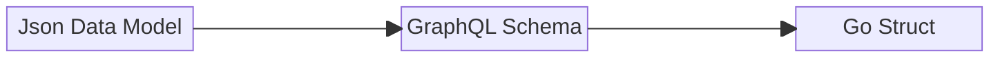
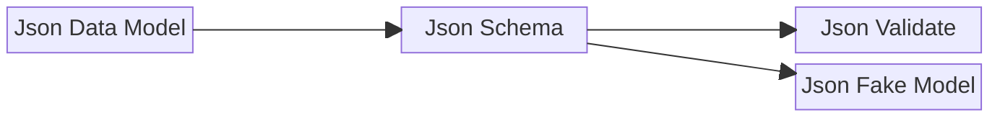

# 概要

スキーマ駆動開発に関する情報を記載しています。


## 設計プロセス


GraphQLのスキーマ定義イメージ




GraphQL Schema
```graphql
scalar Upload

type Content {
  id: ID!
  workspaceId: String!
  tags: [String!]!
  name: String!
  extension: String!
  type: String
  size: Int!
  paths: FilePathInfo!
  image: ImageInfo
  createdAt: String!
  updatedAt: String!
}

type FilePathInfo {
  original: String!
  thumbnail: String!
}

type ImageInfo {
  width: Int
  height: Int
  dateTime: String
}

type Mutation {
  registerContent(file: Upload!, workspaceId: String!, tags: [String!]!): Content!
  removeContent(id: ID!): Content!
}

type Query {
  fetchContent(id: ID!): Content
  downloadContent(id: ID!): Content
}
```

Go Struct
```go
// Code generated by github.com/99designs/gqlgen, DO NOT EDIT.

package model

type Content struct {
	ID          string        `json:"id"`
	WorkspaceID string        `json:"workspaceId"`
	Tags        []string      `json:"tags"`
	Name        string        `json:"name"`
	Extension   string        `json:"extension"`
	Type        *string       `json:"type,omitempty"`
	Size        int           `json:"size"`
	Paths       *FilePathInfo `json:"paths"`
	Image       *ImageInfo    `json:"image,omitempty"`
	CreatedAt   string        `json:"createdAt"`
	UpdatedAt   string        `json:"updatedAt"`
}

type FilePathInfo struct {
	Original  string `json:"original"`
	Thumbnail string `json:"thumbnail"`
}

type ImageInfo struct {
	Width    *int    `json:"width,omitempty"`
	Height   *int    `json:"height,omitempty"`
	DateTime *string `json:"dateTime,omitempty"`
}

type Mutation struct {
}

type Query struct {
}
```


MongoDBのスキーマ定義イメージ


goの実装イメージ
1. json形式で土台を作る
2. 1で作成したjsonを元にjson schemaを作成する
3. 2で作成したjson schemaに値のフォーマットなどを必要に応じて追記する（これがjson validateとなる。json schemaは保持しない）
4. 3.で作成したjson validateを元に、quicktypeでgoの構造体を作成する。（このとき、2で追記したフォーマット情報などは反映されない）
5. 4で作成した構造体に、2で追記したフォーマット情報などを追記する（構造体に対してバリデーション可能なパッケージを探す）
6. 5で作成した構造体を使ってデータの操作やバリデーションを実装する

ダミーデータ作成の実装イメージ
1. 「goの実装イメージ」にある手順3のファイル（json validate）を、json-schema-fakerに食わせてダミーデータを作成する（検証していないので、作成されるデータの精度がどのようなものか確認が必要）
