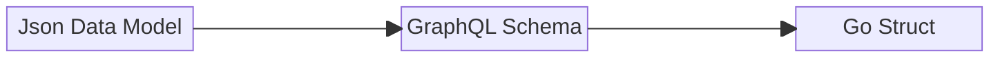
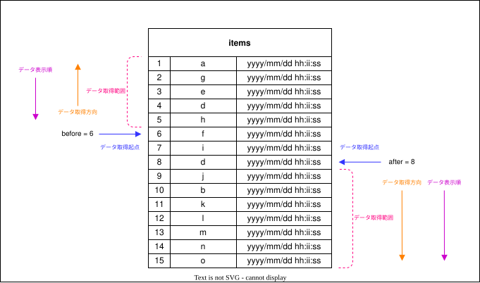
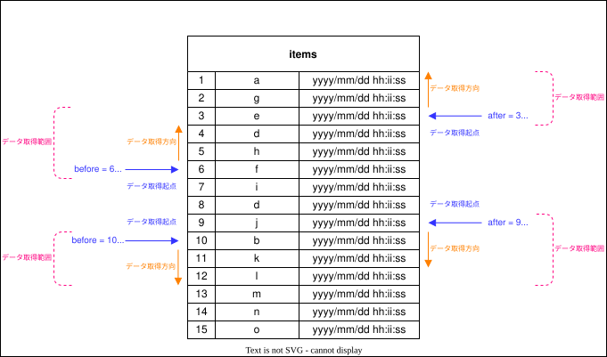

# 概要

スキーマ駆動開発に関する情報を記載しています。

## TODO

GraphQLの特徴と思想を記述する（シンプル・拡張性・柔軟性の部分
その思想をもとに設計はこのように考えるのが適切という理由を記載する
（拡張性されることを前提としているなら、拡張しやすい設計をするのがいいよねっていう話）


## 設計プロセス


GraphQLのスキーマ定義イメージ




**GraphQL Schema Example**
```graphql
scalar Upload

input AddContentInput {
  file: Upload!
  workspaceId: String!
  tags: [String!]!
}

input AddContentsInput {
  item: [AddContentInput!]! @tag(validate: "min=1,dive,required")
}

input DeleteContentInput {
  id: ID! @tag(validate: "mongodb")
}

input AddContentTagsInput {
  id: ID! @tag(validate: "mongodb")
  tags: [String!]! @tag(validate: "min=1,dive,required")
}

input RemoveContentTagsInput {
  id: ID! @tag(validate: "mongodb")
  tags: [String!]! @tag(validate: "min=1,dive,required")
}

input ReplaceContentTagsInput {
  id: ID! @tag(validate: "mongodb")
  tags: [String!]! @tag(validate: "dive,required")
}

input ModifyTag {
  old: String! @tag(validate: "required")
  new: String! @tag(validate: "required")
}

input ModifyContentTagsInput {
  id: ID! @tag(validate: "mongodb")
  tags: [ModifyTag!]! @tag(validate: "min=1,dive")
}

input ContentFilter {
  workspaceId: String @tag(validate: "required")
  ids: [String] @tag(validate: "omitempty,dive,required")
  tags: [String] @tag(validate: "omitempty,dive,required")
  extensions: [String] @tag(validate: "omitempty,dive,required")
  types: [String] @tag(validate: "omitempty,dive,required")
  sizeGte: Int @tag(validate: "omitempty,gte=0")
  sizeLte: Int @tag(validate: "omitempty,gte=0")
}

type ContentPayload {
  id: ID!
  workspaceId: String!
  presignedUrl: String!
  tags: [String!]!
  file: FilePayload!
  createdAt: String!
  updatedAt: String!
}

type FilePayload {
  name: String!
  extension: String!
  type: String!
  size: Int!
}

type Mutation {
  addContent(input: AddContentInput!): ContentPayload!
  deleteContent(input: DeleteContentInput!): ContentPayload!
  addContentTags(input: AddContentTagsInput!): ContentPayload!
  removeContentTags(input: RemoveContentTagsInput!): ContentPayload!
  replaceContentTags(input: ReplaceContentTagsInput!): ContentPayload!
  modifyContentTags(input: ModifyContentTagsInput!): ContentPayload!
}

type Query {
  content(id: ID!): ContentPayload
  contents(filter: ContentFilter): [ContentPayload]
}
```

### 命名方針

#### 基本方針

**1. 明確さと直感性**

ミューテーション名がその操作を明確に表現しているかどうか。

**2. 一貫性**

既存のAPI命名規則や他のミューテーションとの一貫性。

**3. 読みやすさと短さ**

名前が短くて読みやすいかどうか。

#### 補足
- 操作の意図が明確に伝わる名称よりも全体を通して一貫性のある名称を選択する

**Query**
- 概念などのモデル名をそのまま命名します。

**Mutation**
- 動詞 + モデル名となるように命名します。
  - 例）`追加` + `コンテンツ` : `addContent`
- 一括処理の場合は、`bulk` + 動詞 + モデル名 となるように命名します。
  - 例）`削除` + `コンテンツ` : `addContents`
- 入力のモデルを定義し、inputフィールドにモデルを指定する
  - モデル名には接尾時として `Input` をつける
  - 更新や削除のkeyとする情報は `Input` に含める。
    - IDを指定する場合は、`id` というフィールドを定義する。
    - 条件を指定する場合は、`filter` というフィールドを定義する。
- 出力のモデルを定義し、ミューテーションの返り値の型として指定する。
  - 型名には接尾辞として `Payload` をつける（ネストする型も対象）

**その他**
- Query, Mutationの型定義は共有せず、それぞれで定義する。


### transaction

トランザクションのスコープについて

```graphql
mutation CreateUserAndPost($name: String!, $email: String!, $title: String!, $content: String!) {
  createUser(input: { name: $name, email: $email }) {
    id
  }

  createPost(input: { userId: $userId, title: $title, content: $content }) {
    id
    title
    content
    author {
      id
      name
      email
    }
  }
}
```

ミューテーションを同じ階層で呼び出す場合、`createUser` と `createPost` はそれぞれ独立したトランザクションとなるように実装する。

```graphql
mutation {
  createUser(input: { name: "Alice", email: "alice@example.com" }) {
    id
    createPost(input: { userId: $userId, title: "Hello World", content: "This is my first post" }) {
      id
      title
      content
      author {
        id
        name
        email
      }
    }
  }
}
```

ミューテーションをネストして呼び出す場合、`createPost` と `createPost` は1つのトランザクションとなるように実装する。


### 制限事項

- おぺれーしょんの定義方法
  - queryのネストはOK
  - queryの同階層呼び出しはOK
  - mutationのネストはNG
  - mutationの同階層呼び出しはOK
  - transactionはmutation単位で実装（operation単位ではない）


## Pagination

ページネーションはRelay Cursor Connections Specificationの仕様に沿って実装します。

参考
- [GraphQL Cursor Connections Specification](https://relay.dev/graphql/connections.htm)
- [GraphQL Pagination](https://graphql.org/learn/pagination/)

e.g.,

- beforeのみ指定
- afterのみ指定



e.g.,

- firstのみ指定
- lastのみ指定
- beforeとlastを指定
- afterとfirstを指定



下記の組み合わせによるしてはエラーとして扱います。

- beforeとfirstを指定
- afterとlastを指定

**注意点**

下記のパターンで指定したとき、データの取得順は降順となります。そのためデータベースから取得したデータの順番を逆転する処理が必要です。

- beforeのみ指定
- lastのみ指定
- beforeとlastを指定
