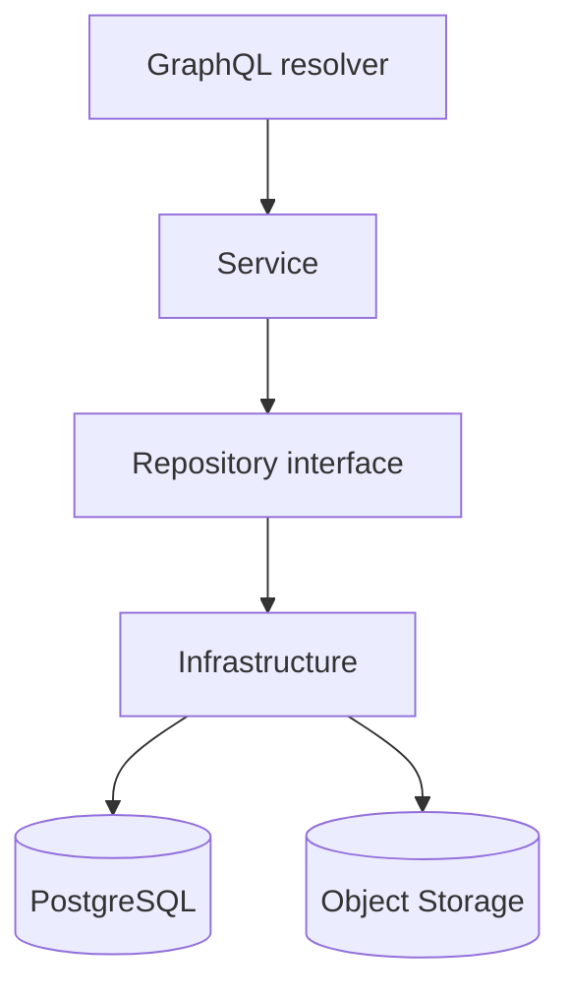

# APIアーキテクチャ

> 状態: 現行実装を基準とした設計  
> 実装の正本: `memoria-api`

APIはGraphQLを入口として、ドメインルール、認証・認可、PostgreSQL、S3互換storageへの入出力を提供します。

- resolverは入出力変換、Serviceはユースケース・ドメインルール・transaction、Repository interfaceは外部I/O境界を担当します。
- domainとserviceからGraphQL、DB、S3の具体実装へ依存しません。
- GraphQLの生成元は`schemas/graphql/`、SQLの生成元は`schemas/postgres/`です。生成物を直接編集しません。
- 認証済みcontextを認可の基準とし、クライアント指定IDを無条件に信頼しません。
