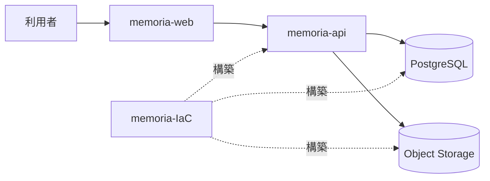

# システム全体構成

> 状態: 現行実装を基準とした設計

Memoriaは4つの独立したGitリポジトリで構成する一つのプロダクトです。マイクロサービスを前提とせず、Web、API、データ、インフラストラクチャの責務境界で整理します。

| リポジトリ | 責務 | 正本とする契約 |
| --- | --- | --- |
| `memoria-web` | Web UI、認証済み画面、GraphQLクライアント | UI挙動、operation、fragment |
| `memoria-api` | GraphQL API、ドメインロジック、永続化、ファイル入出力 | GraphQL・DB schema、storage contract |
| `memoria-design` | プロダクト設計、用語、横断判断 | 設計書、ADR、開発方針 |
| `memoria-IaC` | AWSリソースと実行環境 | runtime、network、IAM、storage resource |

## 責務境界

- WebはAPI契約を利用し、APIのドメインルールを複製しません。
- APIはユースケース、認可、データアクセス、ファイル入出力を所有します。
- データの実行可能な定義はAPI、AWSリソースの構築はIaCが所有します。
- Designは意図と判断を記録し、実行可能なschemaや設定を複製しません。

## マイクロサービス設計を採用しない理由

初期資料はMemoria Record、Content、MongoDBを中心にしていました。現行実装は一つのWebと一つのAPI、PostgreSQL上のImage・ImageGroupが中心で、将来ドメインもMediaとして合意済みです。旧資料の登録、閲覧、編集、削除、ダウンロードは[Media関連ユースケース](/media/use-cases)へ包含済みです。独自の確定事項がなく、旧GraphQL例と永続化方針は現行契約と矛盾するため旧資料は削除します。

詳細は[Web](./web)、[API](./api)、[データ・ストレージ](./data)、[インフラストラクチャ](./infrastructure)、[横断設計](./cross-cutting)の順で参照します。
