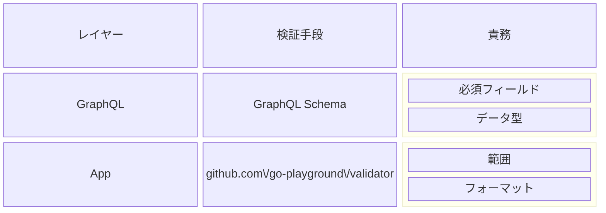
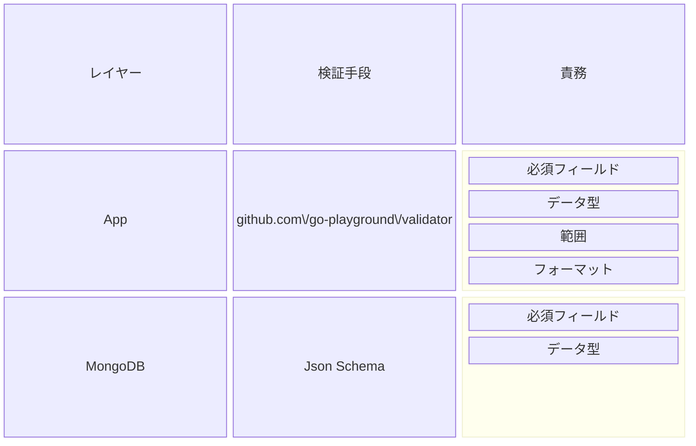
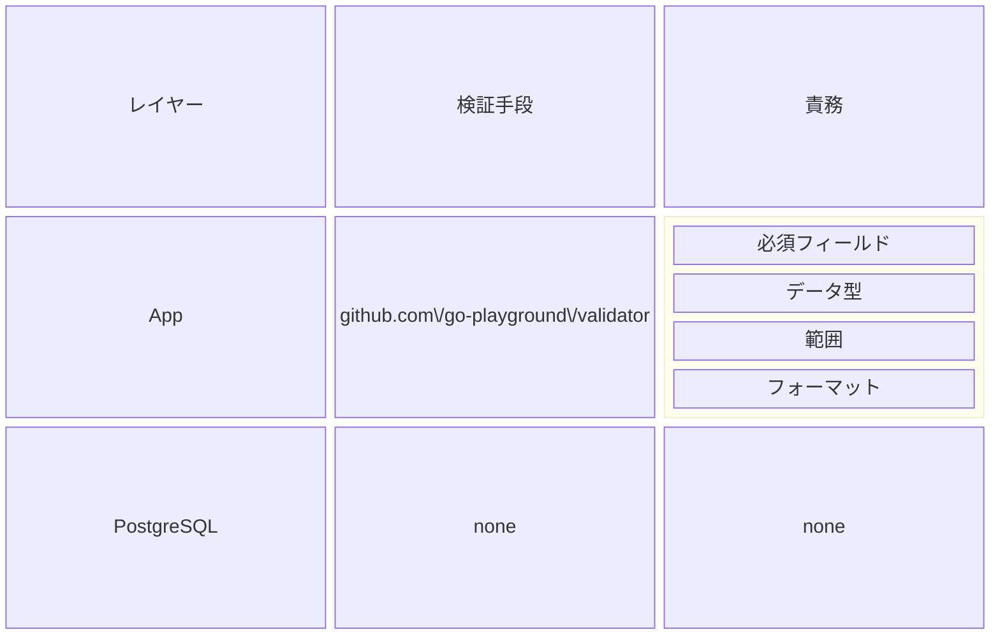

# 入力バリデーション設計

> 状態: 初期設計（一部は現行実装と整合、全体は要確認）

入力バリデーションに関するガイドラインを記載しています。

## 入力バリデーションとは

アプリケーションが受け取るデータが正しい形式や範囲にあるかどうかを確認するプロセスです。正しいバリデーションを行うことで、アプリケーションのセキュリティを向上させ、データの品質を維持し、予期しない動作やエラーを防ぐことができます。

## 入力バリデーションの種類

| No. | 種類 | 説明 |
|:---:|:-----|:-----|
|1    | 必須フィールド | 必要なフィールドが空でないことを確認します。|
|2    | データ型 | 文字列、数値、日付などのデータ型が正しい形式であることを確認します。|
|3    | 範囲 | 数値や日付が許容される範囲内にあるかを確認します。|
|4    | フォーマット | メールアドレスや電話番号など特定のフォーマットに従っているかを確認します。|

値が一意であることや年齢が18歳以上であることなど、特定の条件を満たすかどうかを確認するバリデーションはビジネスロジックに含まれるため、ここでは扱いません。

## 入力バリデーションを必要とする箇所

TODO: 記載する

## 入力バリデーションの実装と責務

OpenAPIやGraphQLのスキーマ定義はバリデーションルールを記述することで、APIの入力バリデーションを実装することができます。ただし、スキーマ定義だけでは対応できないケースもあります。ここでは各技術スタックの入力バリデーションの実装方法と責務について記載します。

### GraphQL

各入力バリデーションの実装手段は以下のとおりです。

GraphQLのスキーマ定義にはAPIの入出力となるインターフェイスを定義する事ができます。スキーマ定義ではフィールド名と型の定義、フィールドの必須・任意を指定することができます。これらはGraphQLを提供するライブラリ・パッケージ側でバリデーションが行われるため、個別に実装する必要はありません。値の形式や範囲をチェックするためのバリデーションはスキーマ定義では実装できません。スカラーという概念もありますが、スカラーは型のチェックと変換を行うためのものであり、複雑なバリデーションを行う用途で使用するには柔軟性が低いです。

GraphQLサーバーは`github.com/99designs/gqlgen`を使用して実装します。スキーマ定義を元にGraphQLサーバーのコードを自動生成するため、スキーマ定義に対応する構造体も生成されます。その構造体に対してバリデーションのタグを追加し、リゾルバーでバリデーションを実行する処理を追加します。

タグの追加とバリデーションの実行には`github.com/go-playground/validator`を使用します。

### MongoDB 

各入力バリデーションの実装手段は以下のとおりです。

### PostgreSQL

各入力バリデーションの実装手段は以下のとおりです。

